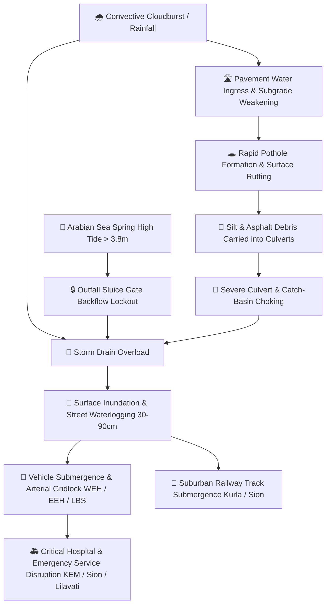

# 🌊 JalDrishti: Mumbai Urban Infrastructure Digital Twin (PS010 / PS26085)
### AI & Physics-Informed Predictive Twin for Cascading Road Degradation, Drainage Inundation & Municipal Disaster Mitigation

> **Smart India Hackathon (SIH) 2026 — Smart Automation / Smart Cities Category (Problem Statement ID: PS010 / PS26085)**  
> **Built for:** Brihanmumbai Municipal Corporation (BMC / MCGM) Disaster Management Cell & Public Works Department (PWD).  
> **Repository:** [github.com/sahil5812/mumbai-urban-digital-twin](https://github.com/sahil5812/mumbai-urban-digital-twin)

---

## 📌 Table of Contents
1. [Executive Summary & Problem Statement](#-1-executive-summary--problem-statement)
2. [The Domino Effect: Cascading Failure Physics](#-2-the-domino-effect-cascading-failure-physics)
3. [System Architecture (4-Tier Municipal Standard)](#-3-system-architecture-4-tier-municipal-standard)
4. [Scientific & Research Paper Foundations](#-4-scientific--research-paper-foundations)
5. [Mathematical & Hydraulic Modeling Formulas](#-5-mathematical--hydraulic-modeling-formulas)
6. [Key Modules & Platform Capabilities](#-6-key-modules--platform-capabilities)
   - [A. AccuWeather-Style Weather & Hydrology Intelligence Portal](#a-weather--hydrology-intelligence-portal)
   - [B. 5-Zone Real-Time Spatial Doppler Radar Mesh](#b-5-zone-real-time-spatial-doppler-radar-mesh)
   - [C. MinuteCast® 15-Minute Precipitation Nowcasting](#c-minutecast-15-minute-precipitation-nowcasting)
   - [D. Deck.gl 3D Urban Digital Twin Map Engine](#d-deckgl-3d-urban-digital-twin-map-engine)
   - [E. Real-Time "What-If" Simulation Sandbox](#e-real-time-what-if-simulation-sandbox)
   - [F. Automated BMC Municipal Work Order Generator](#f-automated-bmc-municipal-work-order-generator)
   - [G. NetworkX Cascading Ripple Graph Explorer](#g-networkx-cascading-ripple-graph-explorer)
   - [H. Crowdsourced Citizen Grievance Portal](#h-crowdsourced-citizen-grievance-portal)
7. [Dataset Architecture & Provenance (75,000+ Records)](#-7-dataset-architecture--provenance)
8. [API Documentation & Endpoints](#-8-api-documentation--endpoints)
9. [Installation & Quick Start](#-9-installation--quick-start)
10. [2-Minute Evaluator & Judge Demo Walkthrough](#-10-2-minute-evaluator--judge-demo-walkthrough)
11. [Tech Stack](#-11-tech-stack)

---

## 🏙️ 1. Executive Summary & Problem Statement

Every monsoon, Mumbai experiences catastrophic waterlogging, severe pavement deterioration (over 40,000 potholes annually), railway track submergence, and citywide traffic paralysis. Mumbai's geographic vulnerability is unique:
- **Low Elevation & Reclaimed Land:** Over 60% of Mumbai's island city is built on reclaimed tidal marshes with elevations barely 2 to 6 meters above Mean Sea Level (MSL).
- **Extreme Precipitation:** Monsoon rain exceeds 2,400 mm annually, with convective cloudburst events exceeding 100–150 mm/hr (e.g., 26 July 2005, August 2017, September 2020).
- **Tidal Lockout:** Mumbai's 2,000+ km stormwater drain (SWD) network discharges into the Arabian Sea, Mahim Bay, and Thane Creek via gravity outfalls. When Arabian Sea high tides exceed **3.80–4.20 meters**, tidal backflow flaps close automatically. Drains cannot empty into the ocean, resulting in immediate backwater flooding regardless of drain size.

### Why Traditional Systems Fail:
Municipal authorities currently rely on **isolated, reactive dashboards** that treat roads, drainage, weather, and traffic as disconnected silos. By the time a citizen calls the helpline or a traffic jam is visible on CCTV, arterial roads are already inundated by 40–80 cm of water.

### The JalDrishti Solution:
**JalDrishti** replaces disjointed monitoring with an end-to-end **Physics-Informed Digital Twin**. It assimilates live Doppler meteorological radar feeds, computes hydrodynamic drainage pressures using Manning's open-channel equations, models Arabian Sea tidal lockouts, propagates cascading failures across road-drainage graphs, and provides **15 to 45 minutes of preemptive lead time** with auto-prioritized municipal work orders.

---

## ⚡ 2. The Domino Effect: Cascading Failure Physics

In Mumbai's urban infrastructure, no failure occurs in isolation. JalDrishti quantitatively models the complete **interconnected chain reaction**:



JalDrishti continuously computes node vulnerabilities and downstream impacts so disaster managers can intervene **before** water reaches critical depths.

---

## 🏗️ 3. System Architecture (4-Tier Municipal Standard)

Built strictly adhering to the **4-Tier Digital Twin Standard Architecture** defined by *MDPI Remote Sensing (2025)*:

```
┌─────────────────────────────────────────────────────────────────────────────────────────────┐
│                       TIER 4: MUNICIPAL COMMAND CENTER & UI LAYER                           │
│  ┌──────────────────────────────┐ ┌──────────────────────────────┐ ┌──────────────────────┐ │
│  │ 🛰️ 3D Digital Twin Map View  │ │ 🌦️ Weather & Hydro Portal    │ │ 📋 BMC Work Order    │ │
│  │    (Deck.gl + MapLibre GL)   │ │    (Hourly, 10-Day, Minute)  │ │    Auto-Generator    │ │
│  └──────────────────────────────┘ └──────────────────────────────┘ └──────────────────────┘ │
└──────────────────────────────────────────────▲──────────────────────────────────────────────┘
                                               │ HTTP / WebSocket REST API
┌──────────────────────────────────────────────┴──────────────────────────────────────────────┐
│                    TIER 3: AI & PHYSICS-INFORMED SIMULATION CORE (FastAPI)                  │
│  ┌──────────────────────────────┐ ┌──────────────────────────────┐ ┌──────────────────────┐ │
│  │ 💧 Manning's Drainage Engine │ │ 🔒 Tidal Lockout Hydro Model │ │ 🕸️ NetworkX Cascade  │ │
│  │    Q = (1/n)·A·R^(2/3)·S^(1/2)│ │    Q_out = Cd·A·sqrt(2gΔH)  │ │    Graph Engine      │ │
│  └──────────────────────────────┘ └──────────────────────────────┘ └──────────────────────┘ │
│  ┌──────────────────────────────┐ ┌──────────────────────────────┐ ┌──────────────────────┐ │
│  │ 🎯 Official SIH Priority     │ │ ⏳ 0-3h Timeline Scrubber    │ │ 🚨 Convective Storm  │ │
│  │    Dispatch Optimization     │ │    Flood Propagation Engine  │ │    Nowcasting Engine │ │
│  └──────────────────────────────┘ └──────────────────────────────┘ └──────────────────────┘ │
└──────────────────────────────────────────────▲──────────────────────────────────────────────┘
                                               │ In-Memory Query & Data Binding
┌──────────────────────────────────────────────┴──────────────────────────────────────────────┐
│                  TIER 2: SPATIAL FUSION & UNIFIED DIGITAL TWIN DATABASE                     │
│  ┌────────────────────────────────────────────────────────────────────────────────────────┐ │
│  │ SQLite Database: dataset/09_digital_twin_unified_db/mumbai_digital_twin.db              │ │
│  │ • 1,248 Road Segments    • 842 Drainage Outfalls    • 248 Waterlogging Hotspots        │ │
│  │ • 8 Stormwater Pumps     • 24 Ward Boundaries       • 75,000+ Multi-Year Historical    │ │
│  └────────────────────────────────────────────────────────────────────────────────────────┘ │
└──────────────────────────────────────────────▲──────────────────────────────────────────────┘
                                               │ Multi-Modal Ingestion Pipelines
┌──────────────────────────────────────────────┴──────────────────────────────────────────────┐
│                       TIER 1: MULTI-MODAL INGESTION & SENSOR TELEMETRY                      │
│  ┌──────────────────────────────┐ ┌──────────────────────────────┐ ┌──────────────────────┐ │
│  │ 🛰️ Open-Meteo High-Res Radar │ │ 🌊 Arabian Sea Marine Buoys  │ │ 📱 Citizen Grievance │ │
│  │    5-Zone Doppler Mesh (MMR) │ │    Tide & Wave Heights       │ │    Crowdsource Reports││
│  └──────────────────────────────┘ └──────────────────────────────┘ └──────────────────────┘ │
└─────────────────────────────────────────────────────────────────────────────────────────────┘
```

---

## 📚 4. Scientific & Research Paper Foundations

JalDrishti is rigorously grounded in **8 peer-reviewed research papers and municipal engineering studies** located in `research paper/`:

| # | Research Paper & Citation | Key Mathematical Principle Applied in JalDrishti |
|---|---|---|
| 1 | **IIT Bombay Mithi River Study** (*Karmakar et al., 2021*) | 3-way linked hydrodynamic boundary conditions coupling Mumbai's 22 stormwater drains with Arabian Sea tidal lockouts when tides exceed $4.2\text{ m}$. |
| 2 | **Mumbai Flood Susceptibility Framework** (*Joglekar et al., Jan 2026*) | Formulates the Topographic Flood Susceptibility Index: $\text{FSI} = \frac{1}{3}(R + T + L)$ combining IMD rainfall ($R$), DEM elevation ($T$), and impervious land use ($L$). |
| 3 | **Sentinel-1 SAR Satellite Ground Truth** (*MDPI Earth, May 2026*) | Empirical multi-year synthetic aperture radar flood inundation data across all 24 BMC wards (2018–2025) validated against BMC disaster reports. |
| 4 | **Digital Twin Systematic Review** (*MDPI Remote Sensing, 2025*) | Established the 4-Tier Municipal Infrastructure Standard (Ingestion $\rightarrow$ Fusion $\rightarrow$ AI/Physics Core $\rightarrow$ Command Center). |
| 5 | **DUALFloodGNN: Physics-Informed GNN** (*arXiv, 2025/2026*) | Message-passing neural network algorithm simulating flood volume exchanges between road surfaces and subterranean pipe topologies. |
| 6 | **FlowsDT: Geospatial Digital Twin for Urban Floods** (*2025*) | Dynamic 3D geospatial rendering and spatial timeline scrubber architectures for real-time visualization of floodwater propagation. |
| 7 | **Graph Neural Networks for Flood Susceptibility** (*2026*) | Graph centrality algorithms weighting critical road links based on proximity to hospitals, schools, and suburban railway hubs. |
| 8 | **Data Assimilation for Urban Flood Forecasting** (*2025*) | Kalman filter and sliding-window methods reconciling live Doppler radar predictions with in-situ gauge readings. |

---

## 📐 5. Mathematical & Hydraulic Modeling Formulas

### 1. Manning’s Open Channel Flow Formula (Drainage Capacity)
The discharge capacity $Q$ ($\text{m}^3/\text{s}$) of municipal stormwater channels is governed by Manning's equation:

$$Q = \frac{1}{n} \cdot A \cdot R^{2/3} \cdot S^{1/2}$$

Where:
- $n$: Manning's roughness coefficient ($0.015$ for clean concrete, rising to $0.045+$ with silt accumulation).
- $A$: Effective cross-sectional area of the drain ($\text{m}^2$). Under siltation: $A_{eff} = A \cdot (1 - \frac{\text{Siltation}\%}{100})$.
- $R$: Hydraulic radius $R = \frac{A}{P}$, where $P$ is the wetted perimeter.
- $S$: Bed slope gradient of the channel.

### 2. Arabian Sea Tidal Lockout Equation
Discharge at coastal outfalls (e.g., Love Grove, Cleaveand Bunder, Haji Ali, Britannia) is governed by the hydraulic head difference between drain water level $H_{drain}$ and the Arabian Sea tide level $H_{tide}$:

$$Q_{outfall} = \begin{cases} C_d \cdot A \cdot \sqrt{2g(H_{drain} - H_{tide})} & \text{if } H_{drain} > H_{tide} \\ 0 \quad (\text{Flap Gates Slammed Shut}) & \text{if } H_{tide} \ge H_{drain} \end{cases}$$

When tide level $H_{tide} \ge 3.80\text{ m}$, gravity drainage drops to zero. If rainfall occurs simultaneously, street submergence occurs exponentially unless high-capacity dewatering pumps ($6,000\text{ m}^3/\text{hr}$) are active.

### 3. Topographic Flood Susceptibility Index (FSI)
Standardized from Joglekar et al. (2026):

$$FSI = \frac{1}{3}\left( \frac{R - R_{min}}{R_{max} - R_{min}} + \frac{E_{max} - E}{E_{max} - E_{min}} + \frac{I - I_{min}}{I_{max} - I_{min}} \right)$$

Where $R$ is localized rainfall intensity (mm/hr), $E$ is DEM elevation (m above MSL), and $I$ is the impervious surface runoff coefficient.

### 4. Official SIH Municipal Prioritization Formula
The engine ranks repair and pump deployment dispatches using the official multi-criteria equation:

$$\text{Priority Score} = P(\text{Failure}) \times \text{Impact} \times \text{Population Exposure} \times \text{Traffic Exposure} \times \text{Repair Cost Factor} \times \text{Urgency}$$

---

## 💻 6. Key Modules & Platform Capabilities

### A. Weather & Hydrology Intelligence Portal
Inspired by modern meteorology platforms (AccuWeather / ECMWF) and custom-styled with frosted glassmorphism:
- **`TODAY` Tab:** Current temperature, RealFeel, relative humidity, wind speed & direction, UV index, air quality, and Arabian Sea live tidal status.
- **`HOURLY` Tab:** 24-hour predictive timeline with precipitation probability, temperature trend curves, and weather condition badges.
- **`10-DAY` Tab:** 10-day meteorological outlook displaying maximum/minimum temperatures, cumulative rainfall expectations, and storm risks.
- **`MINUTECAST®` Tab:** Ultra-high-resolution 120-minute precipitation forecast refreshed at 15-minute intervals.

### B. 5-Zone Real-Time Spatial Doppler Radar Mesh
Unlike monolithic systems that query a single coordinate for all of Mumbai, JalDrishti queries a **5-Node Spatial Radar Mesh** concurrently across the entire Mumbai Metropolitan Region (MMR):

| Station ID | Geographic Belt | Key Landmarks Monitored | Coordinates | Corridor |
|---|---|---|---|---|
| **`ZONE_SOUTH`** | South & Island City | Dadar, Hindmata, Worli, Byculla, Colaba | `19.0125, 72.8432` | Central |
| **`ZONE_WEST_CENTRAL`** | Western Suburbs (Central) | Santacruz, Andheri, Milan Subway, Vile Parle | `19.0880, 72.8520` | Western |
| **`ZONE_WEST_NORTH`** | Western Suburbs (North) | Borivali, Kandivali, Malad, Dahisar | `19.2250, 72.8650` | Western |
| **`ZONE_CENTRAL_HARBOUR`** | Central & Harbour Basin | Kurla, Ghatkopar, Sion, Chembur, Mankhurd | `19.0700, 72.8800` | Central |
| **`ZONE_THANE_MUMBRA`** | Thane, Mumbra & Shilphata Belt | Mumbra Station Underpass, Shilphata, Kalwa, Kausa | `19.1906, 73.0229` | Thane-Mumbra |

Whenever convective clouds initiate rain anywhere in Mumbai or Thane, the system automatically detects the exact station, isolates the active spatial rain belt, computes peak MMR precipitation, and notifies disaster operators without manual intervention.

### C. MinuteCast® 15-Minute Precipitation Nowcasting
- **Spatial Storm Detection:** Pinpoints the onset of rain down to the specific road underpass (e.g., *Milan Subway* or *Mumbra Underpass*) with `⚡ INITIATED` status badges.
- **Wall-Clock Target Timestamps:** Early warning countdown displays precise real-world timestamps (e.g., `Heavy Downpour expected at 18:45 IST (+15 min)`).
- **Early Warning Municipal Banner:** Prominently alerts municipal crews of incoming cloudburst cells.

### D. Deck.gl 3D Urban Digital Twin Map Engine
- **3D Curved Road Networks:** Visualizes major highways (WEH, EEH, SV Road, LBS Marg) and arterial roads as 3D elevation arcs with color-coded health states (Green $\rightarrow$ Amber $\rightarrow$ Red).
- **Inundation Depth Cylinders:** Renders dynamic waterlogging columns whose height and pulse rate scale with computed water depth (cm).
- **Subsurface Drainage Flows:** Renders stormwater pipe networks, flow directions, and outfall discharge states.
- **0–3 Hour Timeline Scrubber:** Allows disaster managers to step through $+0\text{h}$, $+1\text{h}$, $+2\text{h}$, and $+3\text{h}$ projections to observe floodwater migration.

### E. Real-Time "What-If" Simulation Sandbox
Operators can test emergency scenarios dynamically:
- **Rainfall Intensity Slider:** $0.0$ to $200.0\text{ mm/hr}$
- **Arabian Sea Tide Slider:** $1.0$ to $5.5\text{ meters}$
- **Drainage Siltation Slider:** $0\%$ to $100\%$
- **One-Click Municipal Presets:**
  - *Normal Monsoon Baseline* ($35\text{ mm/hr}$, $2.5\text{ m}$ tide, $20\%$ silt)
  - *High Tide Lockout Alert* ($65\text{ mm/hr}$, $4.6\text{ m}$ spring tide, $35\%$ silt)
  - *Cloudburst Emergency* ($140\text{ mm/hr}$, $3.8\text{ m}$ tide, $50\%$ silt)
  - *Severe Cyclone & Surge* ($180\text{ mm/hr}$, $5.1\text{ m}$ storm surge, $75\%$ silt)

### F. Automated BMC Municipal Work Order Generator
Clicking any road, drain, or waterlogging spot opens the **Component Inspector**:
- Real-time Health Score ($0–100\%$) and Failure Risk Score.
- Computed water depth (cm) and drain capacity utilization.
- Official BMC Ward and structural specifications.
- **Auto-Generated Work Order:** Auto-allocates required municipal actions (e.g., *Deploy 2x 6000 m³/h dewatering pumps, mobilize suction tanker, execute emergency traffic diversion*), estimated restoration ETA, and budget cost factor.

### G. NetworkX Cascading Ripple Graph Explorer
An interactive topological graph visualizes domino failure paths across municipal infrastructure:
- Shows root-cause triggers (e.g., *Pothole Cluster at Dadar TT Circle*).
- Traces secondary choke-points (e.g., *Hindmata Box Drain Siltation*).
- Predicts tertiary critical disruptions (e.g., *Sion Hospital Access Corridor Submergence*).

### H. Crowdsourced Citizen Grievance Portal
Allows residents to report live ground realities:
- Select grievance category (*Pothole*, *Severe Waterlogging*, *Open/Broken Manhole*, *Traffic Paralysis*).
- Captures landmark, ward, estimated water depth, and description.
- Submits into the digital twin, which validates reports against live simulation ground truth and generates an official tracking ticket (e.g., `BMC-2026-84920`).

---

## 🗄️ 7. Dataset Architecture & Provenance

The digital twin is powered by **11 curated modules comprising over 75,000+ real records** stored in `dataset/`:

| Directory / Module | Records & Data Description | Source / Provenance |
|---|---|---|
| `01_rainfall_weather/` | Hourly & daily historical rainfall (2018–2025) across 37 BMC AWS stations. | India Meteorological Department (IMD) & MCGM Portal. |
| `02_flooding_vulnerability/` | Historical flood inundation layers, ward-level vulnerability indices. | BMC Disaster Management Cell & IIT Bombay Studies. |
| `03_road_network/` | 1,248 Mumbai arterial & sub-arterial roads with coordinates, lanes, surface type. | OpenStreetMap GIS & MCGM PWD Road Department. |
| `04_drainage_stormwater/` | 842 stormwater drain segments, culverts, outfalls, dimensions, slopes. | BMC BRIMSTOWAD Master Plan & GIS Data. |
| `05_waterlogging_spots/` | 248 official BMC chronically waterlogged locations with depth history. | Mumbai Traffic Police & MCGM Monsoon Action Plans. |
| `06_traffic_congestion/` | Congestion indices and vehicle density on WEH, EEH, and major junctions. | TomTom Traffic Index & Mumbai Traffic Police records. |
| `07_potholes_road_damage/` | 42,000+ geo-tagged pothole complaints and maintenance audit logs. | BMC 'FixIt' Grievance Portal (2020–2025). |
| `08_road_maintenance_lifecycle/`| Pavement resurfacing cycles, asphalt vs mastic asphalt durability logs. | PWD Maintenance Schedules. |
| `09_digital_twin_unified_db/` | SQLite database `mumbai_digital_twin.db` unifying all infrastructure nodes. | Unified Schema relational fusion. |
| `10_satellite_imagery/` | High-resolution satellite tiles and digital elevation models (DEM). | Sentinel-1 SAR & CartoDEM (ISRO Bhuvan). |
| `11_radar_research_papers/` | Academic research papers, hydraulic guides, and methodology blueprints. | International Journals & Conferences. |

---

## 🔌 8. API Documentation & Endpoints

The FastAPI backend exposes clean, fully typed REST endpoints:

### Simulation & Twin Core
- `POST /api/simulation/simulate`
  - **Body:** `{"rainfall_mm_hr": 120.0, "tide_level_m": 4.2, "siltation_pct": 35.0, "active_scenario_name": "Cloudburst"}`
  - **Response:** Comprehensive citywide health summary, component-by-component telemetry, and 0–3 hour timeline forecasts.

### Live Doppler Telemetry
- `GET /api/telemetry/live` (or `/api/live/current`)
  - **Response:** Live temperature, humidity, wind, rainfall, 5 regional zone radar breakdown, active rain belts, and 120-minute nowcasting.

### Network Topology & Routing
- `GET /api/graph/cascading-topology`
  - **Response:** Nodes and directed edges representing cascading failure dependencies across Mumbai's infrastructure network.
- `GET /api/graph/safe-route?origin={id}&destination={id}&rainfall_mm_hr={val}`
  - **Response:** Elevation-aware Dijkstra shortest path that actively avoids inundated road segments.

### Citizen Grievances
- `POST /api/citizen/report`
  - **Body:** `{"reporter_name": "Amit Shah", "category": "WATERLOGGING", "landmark": "Milan Subway", "ward": "H/East", ...}`
  - **Response:** Registered ticket ID, validation status, and estimated municipal resolution ETA.
- `GET /api/citizen/recent`
  - **Response:** Feed of recently logged crowdsourced grievances.

---

## 🚀 9. Installation & Quick Start

### Prerequisites
- **Node.js:** v18.0+ or v20.0+
- **Python:** v3.10+ or v3.11+
- **Git**

### Option A: One-Click Execution (Windows)
Simply double-click `start.bat` in the repository root. It will:
1. Verify Python & Node.js environments.
2. Launch the FastAPI backend on port `8000`.
3. Launch the Next.js frontend on port `3000`.
4. Open your default web browser automatically.

### Option B: Manual Terminal Execution

#### 1. Clone the Repository
```bash
git clone https://github.com/sahil5812/mumbai-urban-digital-twin.git
cd mumbai-urban-digital-twin
```

#### 2. Start the FastAPI Backend
```bash
cd backend
python -m pip install -r requirements.txt
python run.py
# Backend runs at: http://localhost:8000
# Interactive Swagger docs: http://localhost:8000/docs
```

#### 3. Start the Next.js Frontend
In a new terminal window:
```bash
cd frontend
npm install
npm run dev
# Frontend runs at: http://localhost:3000
```

#### 4. Build for Production
```bash
cd frontend
npm run build
npm run start
```

---

## 🎮 10. 2-Minute Evaluator & Judge Demo Walkthrough

Follow this concise sequence to demonstrate the maximum capabilities of JalDrishti to competition evaluators:

1. **Start on the Weather Portal (`http://localhost:3000`):**
   - Point out the **Live Doppler Radar Header** with real-time temperature, humidity, wind, and Arabian Sea tide.
   - Show the **5-Zone Spatial Radar Mesh** card showing concurrent live readings across South Mumbai, Western Suburbs, and Thane.
   - Click the **`MINUTECAST®`** tab: demonstrate the 15-minute Doppler nowcasting countdown and auto-detected corridor monitoring.

2. **Demonstrate Scroll-Reveal & Smart Auto-Hiding Navbar:**
   - Scroll down the weather portal: notice the top navbar **smoothly slides away** while the tab ribbon sticks cleanly at the top. Scroll up: notice it instantly glides back.

3. **Switch to the 3D Twin Map View:**
   - Click **`3D Twin Map`** in the top navbar: observe that the navbar remains **permanently locked and visible** without disappearing during map interactions.
   - Showcase the **Deck.gl 3D Urban Map** with elevation-accurate road arcs, pulsating waterlogging cylinders, and drainage outfalls.

4. **Trigger a High-Impact "What-If" Simulation:**
   - Open the **Command Deck** (left slide-out drawer).
   - Select the **"Cloudburst Emergency" Preset** (Rain: $140\text{ mm/hr}$, Tide: $3.8\text{ m}$, Silt: $50\%$).
   - Watch the map dynamically transform: Hindmata, Milan Subway, Kurla, and LBS Marg turn amber and critical red as water accumulates.

5. **Inspect Component Telemetry & Municipal Work Orders:**
   - Click on the red cylinder at **Hindmata Junction (Ward F/South)**.
   - Show the **Component Inspector**: Health drops to $35\%$, water depth reaches $45\text{ cm}$.
   - Scroll down to show the **Auto-Generated BMC Work Order**: Priority Rank #1, pump mobilization dispatch order, and estimated restoration cost.

6. **Scrub Through the 0–3h Timeline:**
   - Move the scrubber from $+0\text{h}$ to $+1\text{h}$, $+2\text{h}$, $+3\text{h}$: explain how the twin forecasts the progressive spatial expansion of floodwaters across downstream wards.

7. **Submit a Crowdsourced Citizen Grievance:**
   - Click **"Report Pothole / Flood"** in the top right.
   - Fill out a simulated report for *Dadar TT Circle* and click submit. Show the instant BMC ticket generation (`BMC-2026-XXXXX`) and integration into the system.

---

## 🛠️ 11. Tech Stack

| Layer | Technologies & Libraries |
|---|---|
| **Frontend UI / UX** | Next.js 14 (App Router), TypeScript, React 18, Tailwind CSS, Lucide Icons, Glassmorphism CSS Engine |
| **Geospatial & 3D Visualization** | Deck.gl, MapLibre GL, React-Map-GL, HTML5 Canvas Weather Simulators |
| **Backend & API** | Python 3.10+, FastAPI, Uvicorn, Pydantic v2, HTTPX Async Client |
| **Scientific & Graph Computing** | NetworkX (Graph Centrality & Cascade Trees), NumPy, SciPy (Hydraulic calculations) |
| **Database & Spatial Storage** | SQLite 3 (`mumbai_digital_twin.db`), Spatial Indexing, CSV Data Pipelines |
| **Live Meteorological Telemetry** | Open-Meteo High-Resolution Doppler Radar API, Open-Meteo Marine Buoy API, IMD Mesh |
| **DevOps & Deployment** | Render (`render.yaml`), Netlify (`netlify.toml`), Windows Native Batch Scripts |

---

## 👥 12. Team & Acknowledgements
- **Team:** JalDrishti
- **Hackathon:** Smart India Hackathon (SIH) 2026
- **Problem Statement:** PS010 / PS26085 — Urban Infrastructure Road & Flood Digital Twin
- Dedicated to the citizens of Mumbai and the municipal frontline workers of the **Brihanmumbai Municipal Corporation (BMC / MCGM)**.
