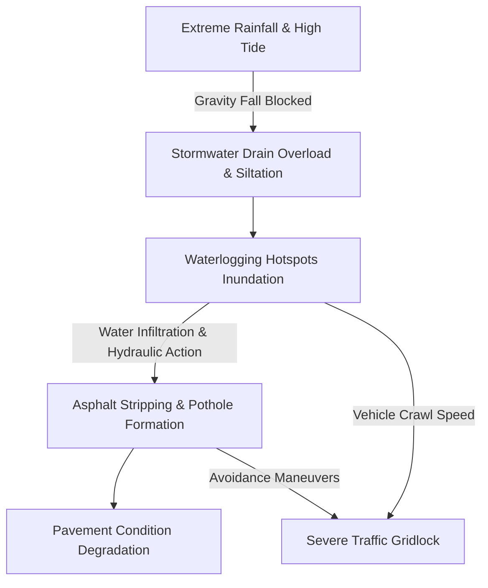

# Mumbai Urban Infrastructure Digital Twin Dataset (PS010)

## Problem Statement
**Municipal Corporation of Greater Mumbai (MCGM / BMC) - PS010 (Smart Cities)**:
*Develop a city-scale AI Urban Infrastructure Digital Twin integrating road networks, drainage networks, rainfall, tides, traffic, road age, maintenance records, flood history, IoT sensors, satellite imagery and citizen reports. Predict interconnected failures: Road degradation to Pothole formation to Drain blockage to Water accumulation to Flood risk to Traffic disruption.*

---

## Directory Structure

```
dataset/
├── 01_rainfall_weather/
│   ├── mumbai_historical_weather_daily_2019_2024.csv       (Open-Meteo & IMD daily weather)
│   ├── mumbai_hourly_monsoon_rainfall_2021_2024.csv        (Hourly station rainfall & storm intensity)
│   ├── bmc_automatic_weather_stations.csv                 (60 AWS stations across all 24 wards)
│   └── mumbai_tide_levels_2021_2024.csv                    (High/Low tide harmonic levels & warnings)
├── 02_flooding_vulnerability/
│   ├── mumbai_historical_flood_events.csv                  (2005, 2017, 2019, 2021, 2023, 2024 flood events)
│   ├── ward_flood_vulnerability_index.csv                  (24 BMC administrative wards vulnerability score)
│   └── mumbai_flood_inundation_zones.geojson               (GIS spatial inundation polygons WGS84)
├── 03_road_network/
│   ├── mumbai_road_network_master.csv                      (100+ Road segments: WEH, EEH, SV Road, LBS, etc.)
│   ├── mumbai_road_network.geojson                         (LineString GIS spatial road network)
│   └── mumbai_road_segments_topology.csv                   (Graph network adjacency edges for GNNs)
├── 04_drainage_stormwater/
│   ├── mumbai_major_nallahs_and_rivers.csv                 (Mithi, Poisar, Oshiwara, Dahisar, Box Drains)
│   ├── bmc_stormwater_pumping_stations.csv                 (Britannia, Haji Ali, Love Grove, Irla, etc.)
│   └── swd_outfalls_and_floodgates.csv                     (Coastal outfall gates & tidal lockout levels)
├── 05_waterlogging_spots/
│   ├── bmc_chronic_waterlogging_hotspots.csv               (Official Hindmata, Milan/Andheri Subway, etc.)
│   ├── waterlogging_spots_spatial.geojson                  (Point GIS spatial layer with elevation & cause)
│   └── waterlogging_sensor_telemetry_timeseries.csv        (Hourly IoT water depth sensor readings)
├── 06_traffic_congestion/
│   ├── mumbai_traffic_corridors_baseline.csv               (Key corridor free-flow vs peak baseline speeds)
│   └── mumbai_hourly_traffic_disruption_timeseries.csv     (Rainfall/Waterlogging-induced speed drops & delay)
├── 07_potholes_road_damage/
│   ├── mybmc_pothole_incidents_register.csv                (Pothole GPS, dimensions, severity, repair status)
│   └── road_surface_defect_telemetry.csv                   (International Roughness Index (IRI) & crack scores)
├── 08_road_maintenance_lifecycle/
│   ├── bmc_road_maintenance_and_dlp_register.csv           (Cement Concrete vs Asphalt, DLP periods, contractors)
│   └── pavement_condition_index_history.csv                (Multi-year PCI degradation curves 2019-2024)
└── 09_digital_twin_unified_db/
    ├── mumbai_digital_twin.db                              (Consolidated SQLite relational database)
    ├── schema.sql                                          (Full SQL schema with foreign keys)
    └── query_cascading_failure.py                          (Python test script for cascading failure analysis)
```

---

## Interconnected Failure Cascade



## How to Query the Unified Database
```bash
python 09_digital_twin_unified_db/query_cascading_failure.py
```
